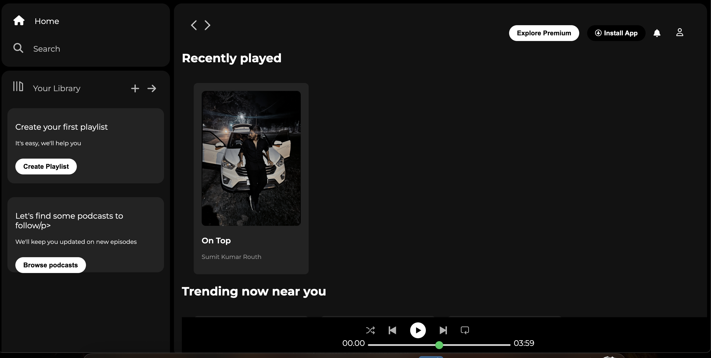

# 🎵 Spotify Clone

A responsive front-end clone of the Spotify web player built using **HTML** and **CSS**. This project replicates the look and feel of Spotify's music streaming interface for learning and practicing front-end design.

---

## 🚀 Features

- 🎧 Responsive UI inspired by Spotify
- 📱 Mobile-friendly layout
- 💚 CSS-only design (no JavaScript)
- 🎨 Clean and modern styling

---

## 📸 Screenshot

> Make sure you have a `screenshot.png` image in your repo root, or update the file path.

---

## 🛠️ Tech Stack

- HTML5
- CSS3
- Google Fonts
- Flexbox & Grid

---

## 📂 Folder Structure
spotify-clone/
├── index.html
├── style.css
└── assets/
└── images/
└── logo.png
└── screenshot.png

